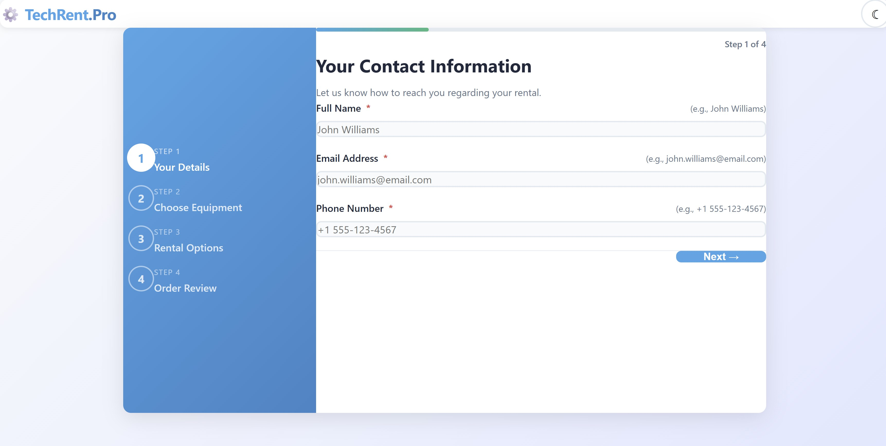

# Tech Equipment Rental – Multi‑Step Booking Form

This repository contains the solution to a multi‑step booking form challenge on Frontend Mentor. The form guides users through entering contact information, selecting equipment, choosing rental options, and reviewing a cost summary before confirming the booking.

## Table of contents

- [Overview](#overview)
  - [The challenge](#the-challenge)
  - [Screenshot](#screenshot)
  - [Links](#links)
- [My process](#my-process)
  - [Built with](#built-with)
  - [What I learned](#what-i-learned)
  - [Continued development](#continued-development)
  - [Useful resources](#useful-resources)
  - [AI Collaboration](#ai-collaboration)
- [Author](#author)
- [Acknowledgments](#acknowledgments)

## Overview

### The challenge

Users should be able to:

- Complete a four‑step booking workflow
- Navigate back to previous steps to adjust their inputs
- See a progress indicator and step number
- Select equipment, rental duration, and optional add‑on services
- View a dynamic summary with calculated costs
- Experience responsive layouts for mobile and desktop
- Receive inline validation errors for required fields and formats

The project adapts the generic multi-step form requirements to a tech equipment rental use case.

### Screenshot

> Add a screenshot of your solution by replacing the image above. A full‑height or cropped capture works well.

### Links

- Solution URL: https://github.com/MercySupremeAJ/multi-step-form
- Live Site URL: multi-step-form-kappa-ebon.vercel.app

## My process

### Built with

- Semantic HTML5 markup
- Custom CSS properties and variables
- CSS Grid & Flexbox for layout and responsiveness
- Vanilla JavaScript (ES6 classes) for state management and DOM updates
- Mobile‑first workflow with media queries

### What I learned

Working through this challenge helped me solidify a few core skills:

- Structuring a multi-step workflow without a framework, encapsulated in a single RentalBookingForm class.
- Writing form validation logic and displaying contextual error messages.
- Updating a progress bar and sidebar step indicators as the user navigates.
- Computing totals and discounts dynamically based on selected duration and services.
- Preserving theme preference (light/dark) using localStorage and toggling styles with CSS variables.
- Ensuring keyboard focus management and responsive adaptations for small screens.

`js
updateProgress() {
  const progress = (this.currentStep / this.steps.length) * 100;
  this.progressBar.style.width = ${progress}%;
  this.progressText.textContent = Step  of ;
}
`

### Continued development

Future improvements I'm considering:

- Add ARIA live announcements for validation errors and summary updates for screen readers.
- Move pricing data to an external JSON or backend service and fetch it asynchronously.
- Implement smoother animations between steps with scroll-timeline or IntersectionObserver.
- Introduce automated tests (Jest/Cypress) to assert form behavior.
- Wire the form to a real backend API to persist bookings and handle edge cases.

### Useful resources

- [MDN – Form validation](https://developer.mozilla.org/en-US/docs/Learn/Forms/Form_validation) – excellent reference for constraint validation API.
- [CSS-Tricks – Complete Guide to Grid](https://css-tricks.com/snippets/css/complete-guide-grid/) – helpful for layout decisions in the equipment selection.
- [Frontend Mentor Community](https://www.frontendmentor.io/community) – seeing other people’s solutions gave me ideas for structuring state.

### AI Collaboration

I used GitHub Copilot throughout the project to accelerate boilerplate code and offer suggestions on event listeners and helper methods. When I needed a second opinion on regex patterns or wanted to brainstorm edge cases, I consulted ChatGPT. The AI tools sped up development, but I always reviewed and tailored the output to ensure it matched the project requirements.

## Author

- GitHub - [@MercySupremeAJ](https://github.com/MercySupremeAJ)
- Frontend Mentor - [@MercySupremeAJ](https://www.frontendmentor.io/profile/MercySupremeAJ)

## Acknowledgments

Thanks to Frontend Mentor for the challenge and to the community for sharing insights. 
